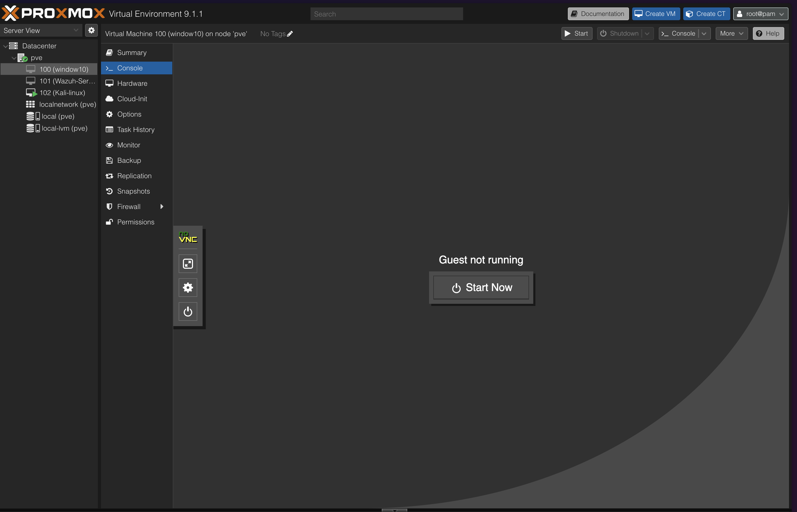
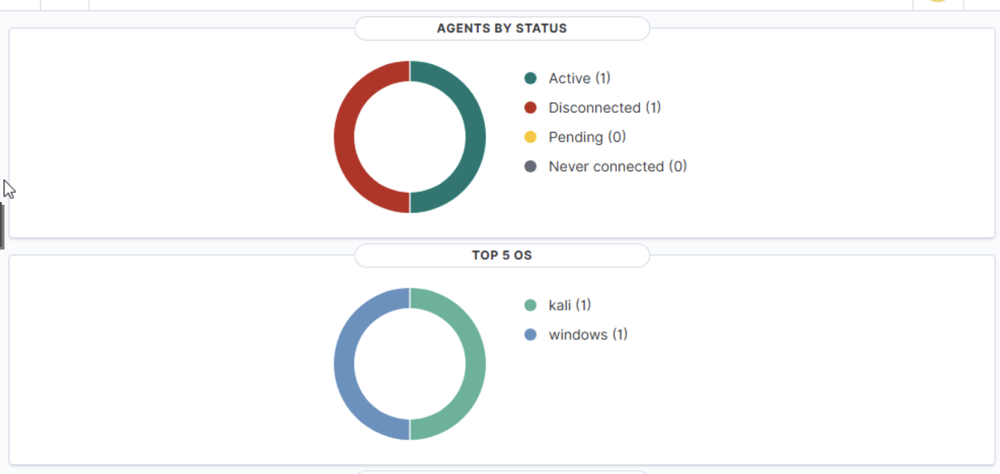
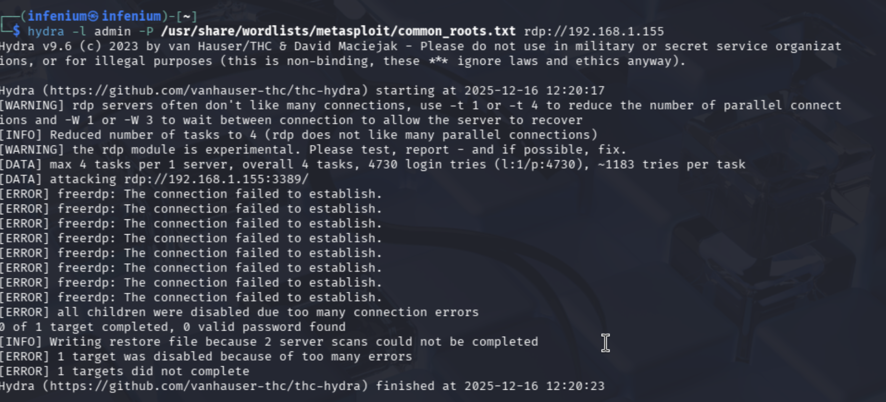
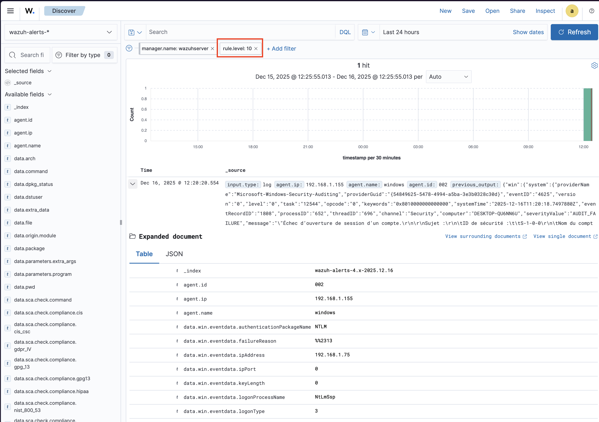

# SOC Automation Project: Brute Force Detection & Active Response with Wazuh

## Project Overview
This project focuses on deploying a complete **Security Operations Center (SOC)** infrastructure using **Wazuh** (SIEM/XDR) in a home lab environment hosted on 

**Proxmox VE**. 

The primary objective was to simulate a real-world cyber attack (RDP Brute Force) and configure an automated defense mechanism using Wazuh's **Active Response** capabilities to block the attacker immediately.

## Architecture & Infrastructure
The lab was built using a Type-1 Hypervisor (Proxmox) hosting three distinct virtual machines:

* **SOC Manager:** Ubuntu Server hosting the Wazuh Manager & Indexer.
* **The Victim:** Windows 10 (Target endpoint with Wazuh Agent installed).
* **The Attacker:** Kali Linux (Used for penetration testing).

*Figure 1: Virtual Infrastructure running on Proxmox VE.*

## 🛠️ Technologies Used
* **Hypervisor:** Proxmox Virtual Environment 9.1.1
* **SIEM/EDR:** Wazuh Open Source Security Platform
* **Attacker Tools:** Hydra (for Brute Force), Nmap
* **Telemetry:** Sysmon, Windows Event Logs

---

## ⚡ The Scenario

### 1. Monitoring Setup
After deploying the infrastructure, the Wazuh Agent was installed on the Windows 10 endpoint. The dashboard immediately began receiving telemetry regarding the system's health and security events.

*Figure 2: Wazuh Dashboard showing active agents (Windows & Kali) and OS distribution.*

### 2. The Attack Phase
Using **Kali Linux**, I initiated a Brute Force attack against the Windows RDP service (port 3389) using the tool `Hydra`. The goal was to attempt multiple login variations to compromise the "Admin" account.

`Command used: hydra -l admin -P /usr/share/wordlists/rockyou.txt rdp://[Target_IP]`

*Figure 3: Execution of the Hydra Brute Force tool from the Kali VM.*

### 3. Detection & Analysis
Wazuh successfully ingested the Windows Event Logs (specifically **Event ID 4625**: *An account failed to log on*). The SIEM correlated these events and triggered a high-severity alert (`Rule Level 10`).

As seen in the logs below, the manager captured crucial details:
* **Workstation Name:** Windows
* **Event ID:** 4625
* **Logon Type:** 3 (Network)
* **Auth Package:** NTLM

*Figure 4: Wazuh alerts showing multiple authentication failures indicative of a brute force attempt.*

### 4. Active Response (Defense)
To automate the defense, I configured the `ossec.conf` on the Wazuh Manager to trigger an **Active Response**.
* **Trigger:** Multiple authentication failures (Rule ID 5710/5712).
* **Action:** `firewall-drop` (or `netsh` command on Windows).
* **Result:** The attacker's IP address was automatically blocked for a set duration, effectively stopping the brute force attempt without human intervention.

## Key Takeaways
* Successfully deployed a Client-Server architecture for log management.
* Configured custom rules and decoders in Wazuh.
* Demonstrated practical understanding of **Windows Event IDs** (4624, 4625).
* Implemented **SOAR** (Security Orchestration, Automation, and Response) concepts via Active Response scripts.

---
*Created by CLERC Tom*
